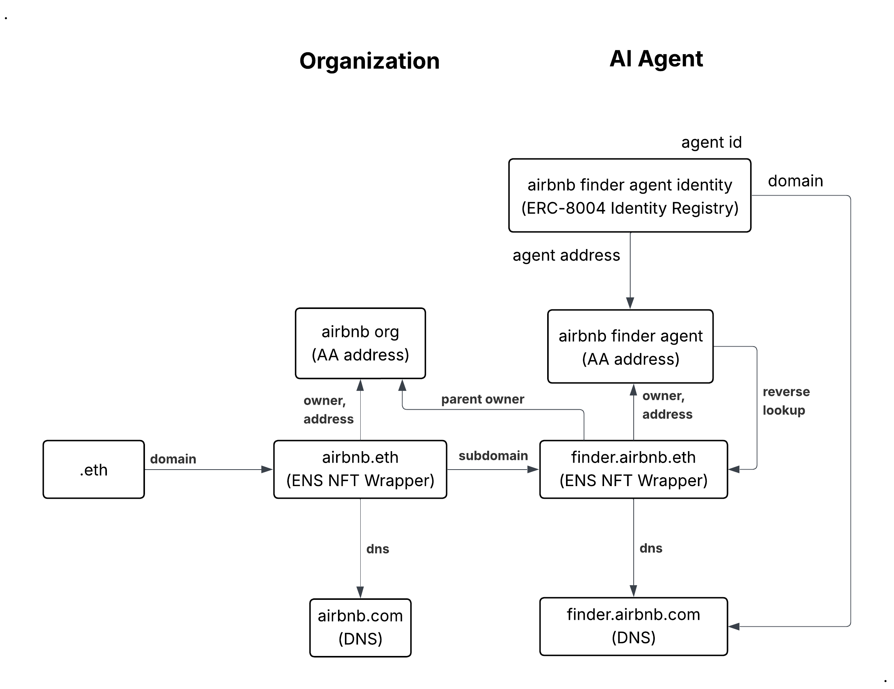

# EAIS, Agent Identity Service for Ethereum Blockchain



## 🛡️ EAIS: Agent Identity Service for Ethereum Blockchain

**EAIS** provides a standardized way to create, manage, and authenticate autonomous agent identities on Ethereum, building on the **ERC-8004 Trustless Agents** specification.

### 🔍 Explorer View of ERC-8004

Just as **EAS (Ethereum Attestation Service)** serves as an explorer and interface for Ethereum Attestations, **EAIS** functions as the **Explorer View of ERC-8004 Trustless Agents**. This web application provides a comprehensive interface for discovering, managing, and interacting with registered agents on the Ethereum blockchain.

### 🏗️ Core Features

* **ERC-8004 Identity Registry**  
Agents are registered in a decentralized **Identity Registry**, each receiving an immutable `agentId`, `agentDomain`, and on-chain `agentAddress`. This makes agents universally discoverable and verifiable across the agent economy.

* **Multi-Agent Management via Account Abstraction (ERC-4337)**  
EAIS leverages **Account Abstraction (AA)** to let a single embedded wallet manage multiple agents. Each registered agent is automatically assigned its own **dedicated AA smart account**, giving it isolated signing authority and preventing exposure of the primary EOA.

* **Automated Agent Card Generation**  
With each registration, EAIS generates a standards-compliant `agent-card.json` file placed under the agent's `.well-known` directory. This file encodes the registry fields and includes a cryptographic signature, ensuring that agents can prove their identity and origin when interacting with others.

* **ENS Integration & Subdomain Management**  
Built-in support for **Ethereum Name Service (ENS)** integration, allowing agents to claim human-readable subdomains under parent ENS domains. Features include reverse lookup, subdomain creation, and seamless identity resolution.

* **Scalable & Secure by Design**  
Developers can seamlessly onboard organizations or services, roll out multiple agents under one wallet, and enable them to transact, verify credentials, and build reputation — all anchored on Ethereum.

### 🎥 Demo Video

Watch our demo video from the [MetaMask Embedded Wallets and Solana Dev Cook-Off](https://www.hackquest.io/projects/MetaMask-Embedded-Wallets-and-Solana-Dev-Cook-Off-EAIS-Agent-Identity-Service):

[](https://www.hackquest.io/projects/MetaMask-Embedded-Wallets-and-Solana-Dev-Cook-Off-EAIS-Agent-Identity-Service)

---

👉 In essence: **EAIS + ERC-8004 + ERC-4337** enables a decentralized, secure, and scalable identity layer for the emerging agent economy on Ethereum.

## Quick start

```bash
# 1) Set env
cp .env.example .env

# ensure correct pnpm version (optional but recommended)
corepack enable
corepack prepare pnpm@9.7.0 --activate

# remove potentially broken installs and caches
rm -rf node_modules apps/*/node_modules apps/*/.next
rm -f pnpm-lock.yaml

# fresh install at the workspace root
pnpm install


pnpm dev:indexer


pnpm dev:web
```

Open http://localhost:3000.


## Credits
This implementation draws from the ChaosChain reference work:
[trustless-agents-erc-ri](https://github.com/ChaosChain/trustless-agents-erc-ri).

## Specification

Implements: [ERC-8004: Trustless Agents](https://eips.ethereum.org/EIPS/eip-8004)  
_Status: Draft (Standards Track: ERC)_

[](https://eips.ethereum.org/EIPS/eip-8004)


See **WSL setup** in this README for recommended steps on Windows Subsystem for Linux.


